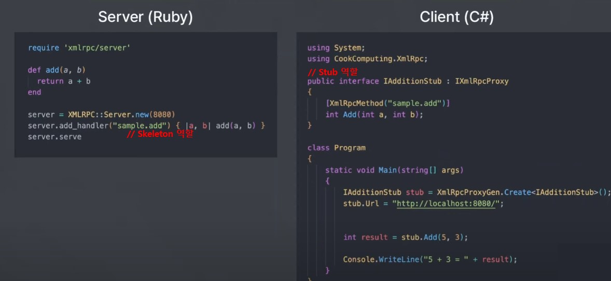

#### RPC (Remote Procedure Call)
: **별도의 원격 제어를 위한 코딩 없이** 다른 주소 공간에서 **함수나 프로시저**를 실행할 수 있게 하는 **프로세스간 통신 기술**이다.
일반적으로 프로세스는 자신의 주소 공간 안에 존재하는 함수만 호출하여 실행 가능하지만, PRC의 경우 **네트워크 메시징**을 수행하여 자신과 **다른 주소 공간에서 동작하는 프로세스의 함수를 실행**할 수 있다.

**stub(스텁)**
: Parameter 객체를 Message로 Marshalling/Unmarshalling하는 레이어이다.
서버와 클라이언트는 서로 다른 주소 공간을 사용하므로 함수 호출에 사용된 매개 변수를 변환해줘야 한다. 그렇지 않으면 메모리 매개 변수에 대한 포인터가 다른 데이터를 가리키게 되기 때문이다.

| 구분           | 클라이언트 (Stub)                  | 서버 (Skeleton)                    |
| ------------ | ----------------------------- | -------------------------------- |
| **역할**       | 원격 메서드를 로컬 메서드처럼 호출할 수 있도록 해줌 | 클라이언트의 요청을 받아 실제 서버 메서드를 호출      |
| **네트워크 처리**  | 원격 요청을 서버로 전송                 | 클라이언트 요청을 받아 실제 메서드를 실행하고 응답을 반환 |
| **직렬화/역직렬화** | 요청을 XML/JSON 등으로 변환하여 전송      | 클라이언트의 요청을 역직렬화하고 결과를 직렬화하여 반환   |

예시 ) XML RPC

서버나 통신과정에 대해 고려할 필요 없이 마치 로컬의 함수를 가져다 쓰듯 기능들을 필요에 따라 사용할 수 있다.

## gRPC
: 구글에서 개발한 환경의 제약 없이 실행할 수 있는 최신 오픈 소스 고성능 원격 프로시저 호출(RPC) 프레임워크이다.

**특징**
- 메세지 Key 간소 (Protocol buffer 사용)
- 바이너리 형태로 직렬화하여 데이터 전송
  -JSON과 같은 텍스트 기반 방식에 비해 용량이 작아, 훨씬 빠르게 전송 가능
  -RESTful API 같은 방식에 비해 효율적으로 요청,응답 가능
- HTTP/2 기반
- TLS(Trasport Layer Security)를 통해 데이터를 암호화하여 전송

*메세지 Key 간소*
RESTful API 에서는 json을 형식을 통해 데이터를 받을 때,  json 데이터의 형식이 반복 되다보면 KEY 부분에 있어서 덜어내야 할 부분이 필요하지만 gRPC에서는 protocol buffer를 사용.

*HTTP/2*
: 서버, 클라이언트가 서로 동시에 메세지를 보낼 수 있고, 서버가 클라이언트의 요청과 별개로 능동적으로 메세지를 보낼 수 있음.

*TLS*
: 데이터를 훔쳐보고나, 변경하거나, 클라이언트 또는 서버를 사칭하지 못하도록 함.

**gRPC 사용이 적은 이유**
: 브라우저에서 동작하는 웹 프로트앤드에서는 거의 사용되지 않음.
대부분의 주류 브라우저들이 HTTP/2를 지원하지만 gPRC에 필요한 HTTP/2 상세 기능들에 대해서는 아직 지원이 부족한 문제가 있다.
브라우저에서 gPRC 호출은 proxy의 도움으로 만들 수 있지만, 완전히 호환되지 않음.

**사용처**
: 전자상거래플랫폼, 은행 및 금융 서비스, IOT 및 디바이스 관리, 모바일 어플리케이션, 게임..등 실시간 상호작용과 동시화가 필요한 곳에서 사용.

### 참고사항
#### 📌  RPC 비교 정리

|RPC 방식|데이터 형식|전송 프로토콜|주요 특징|사용 사례|
|---|---|---|---|---|
|**XML-RPC**|XML|HTTP|단순, 경량|초창기 웹 서비스|
|**JSON-RPC**|JSON|HTTP, WebSocket|경량화된 API|블록체인 (Bitcoin, Ethereum)|
|**gRPC**|Protocol Buffers|HTTP/2|고성능, 스트리밍 지원|마이크로서비스 (Kubernetes)|
|**SOAP**|XML|HTTP, SMTP|보안 강력, 표준화|금융, 공공기관|
|**CORBA**|바이너리|IIOP|이기종 시스템 지원|금융, 대규모 기업 시스템|
|**Java RMI**|Java 직렬화|TCP/IP|Java 전용|Java 분산 시스템|
|**DCOM**|바이너리|TCP/IP|Windows 전용|Windows 네트워크|
|**Thrift**|바이너리/JSON|TCP/IP|멀티 언어 지원|빅데이터, 마이크로서비스|

#### 📌 어떤 RPC를 선택해야 할까?

| 사용 사례                 | 추천 RPC            |
| --------------------- | ----------------- |
| **웹 API 통신 (경량화)**    | JSON-RPC, XML-RPC |
| **마이크로서비스 & 고성능 API** | gRPC, Thrift      |
| **금융, 공공기관, 트랜잭션**    | SOAP              |
| **이기종 시스템 간 통신**      | CORBA             |
| **Java 시스템 간 통신**     | Java RMI          |
| **Windows 네트워크 환경**   | DCOM              |
| **빅데이터, 대량 트래픽 처리**   | Thrift            |

## 참고
---
[gRPC란? - 티스토리](https://velog.io/@dojun527/gRPC%EB%9E%80)
[gRPC란-무엇인가 - VELOG](https://kimdabang.tistory.com/entry/gRPC%EB%9E%80-%EB%AC%B4%EC%97%87%EC%9D%B8%EA%B0%80)
[gRPC - 알고 나면 쉬움 - youtube](https://www.youtube.com/watch?v=uwrR5e5_FH8&list=PLpO7kx5DnyIGzsb-4N9Z76RIR1xfprlIl&index=5)
gpt 질의
- RPC 종류와 각각 언제 사용하는지 알려줘