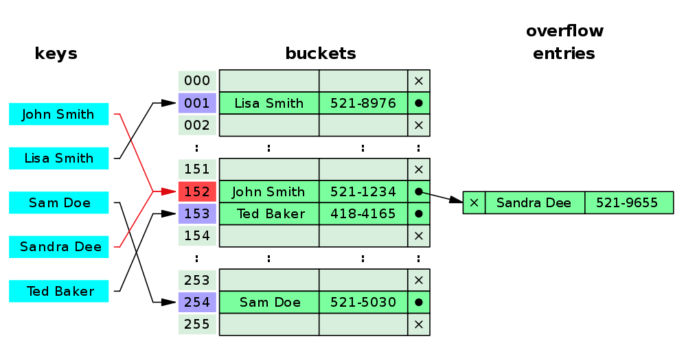
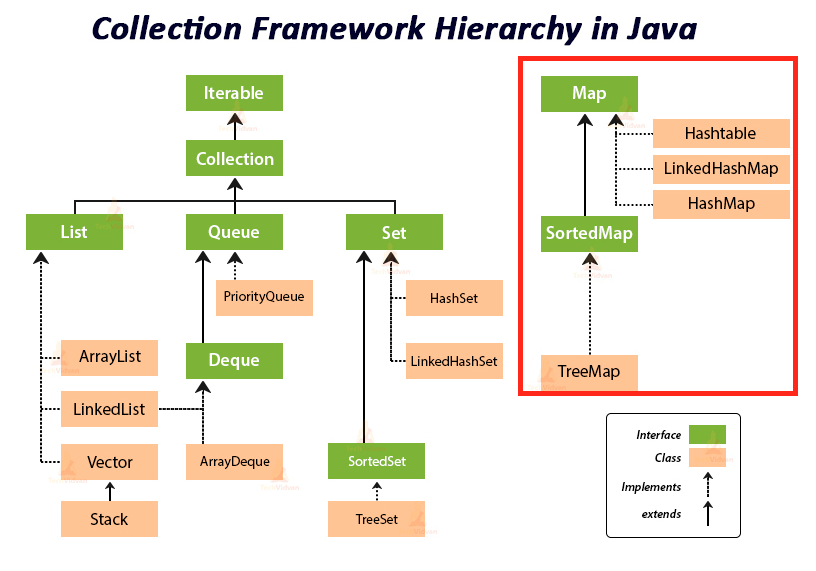

## Hash

### 해시 알고리즘
- **정의**: 해시 알고리즘은 **데이터를 고정된 길이의 해시 값** 으로 변환하는 함수. 예를 들어, 문자열, 파일, 숫자 등 어떤 데이터든 고정된 길이의 고유 코드로 바꿀 수 있다.
- **특징**:
    - **고정된 출력 길이**: 입력 데이터 크기와 무관하게 일정한 길이의 해시 값이 생성된다.
    - **충돌 저항성**: 서로 다른 입력 데이터가 같은 해시 값을 가질 확률이 매우 낮을수록 좋은 해시 알고리즘이다.
    - **불가역성**: 해시 값만으로 원래 데이터를 복원할 수 없어야 한다.

- **예시**:
    - 데이터: `"hello"`
    - SHA-256 해시 값: `2cf24dba5fb0a30e26e83b2ac5b9e29e1b161e5c1fa7425e73043362938b9824`
    - 데이터: `"hello world"`
    - SHA-256 해시 값: `b94d27b9934d3e08a52e52d7da7dabfac484efe37a5380ee9088f7ace2efcde9`
    - [SHA-256 Online Tools](https://emn178.github.io/online-tools/sha256.html)

### 해시 테이블(Hash Table)
- **정의**: 해시 함수를 활용하여 데이터를 저장하고 검색하는 효율적인 자료구조.
- **구조**:
    - **키-값 쌍**으로 데이터를 저장.
    - 키를 해시 함수에 입력하여 생성된 해시 값(`인덱스`)을 기반으로 데이터를 저장.
    - **버킷** : 해시 테이블에서 해시 값이 동일한 항목들을 저장하는 공간. 버킷은 하나 이상의 키-값 쌍을 저장할 수 있으며, 버킷 안에 키-값 쌍들은 일반적으로 연결 리스트로 관리된다.
    - 해시 값이 동일할 경우(충돌), 이를 처리하기 위한 **충돌 해결 메커니즘**(예: `체이닝` 또는 `오픈 어드레싱`)을 사용.

- **장점**:    
  - 데이터의 평균 검색 시간 복잡도가 `O(1)`로 매우 빠름.
    > `O(1)` : (상수) 입력 크기와 상관 없이 일정한 실행 시간을 가짐.   
    `O(logn)` : (로그)연산이 한번 실행 될 때 마다 데이터의 크기가 절반 감소하는 알고리즘 (Tree)   
    `O(n)` : ( 선형)입력 크기와 비례하는 실행 시간
  
    

### 해시 충돌
- **정의**: 서로 다른 입력값이 동일한 해시 값을 가지는 현상
- **충돌 해결 방법** 
  - **체이닝(Chaining)** : 충돌이 발생한 인덱스에서 링크드 리스트를 사용해 데이터를 추가로 연결.
  - **오픈 어드레싱(Open Addressing)** : 충돌이 발생하면, 해시 테이블 내의 다른 빈 슬롯을 찾아 데이터를 저장.

| **특징**          | **체이닝**                                   | **오픈 어드레싱**                             |
|--------------------|---------------------------------------------|---------------------------------------------|
| **구조**           | 연결 리스트 또는 동적 배열 사용               | 모든 데이터를 해시 테이블 내에 저장          |
| **공간 효율성**    | 추가 메모리 필요                            | 추가 메모리 필요 없음                       |
| **검색 성능**      | 충돌이 많아지면 리스트 순회로 성능 저하 가능   | 충돌이 많아지면 탐사 과정으로 성능 저하 가능 |
| **충돌 처리 방식** | 연결 리스트를 순회                          | 빈 슬롯을 탐사                              |
| **장점**           | 충돌 데이터가 많아도 검색과 삽입이 비교적 단순 | 해시 테이블 공간만으로 데이터 관리 가능      |
| **단점**           | 추가 메모리 사용 및 연결 리스트 순회 비용      | 테이블이 가득 차면 성능 급격히 저하          |

### JAVA 에서의 Hash 

- **HashMap** : Map 인터페이스를 구현한 클래스로, 해싱 기법을 사용하여 **키와 값의 쌍**을 저장한다.
- **HashTable** : Map 인터페이스를 구현한 클래스로, 해싱 기법을 사용하여 **키와 값의 쌍**을 저장한다. 동기화된 메소드를 제공하여 **스레드에 안전**하다.
- **LinkedHashMap** : HashMap의 하위 클래스로, 키-값 쌍을 `HashMap`에 저장하는 동시에 더블 링크드 리스트에도 입력 순서에 따라 저장합니다.     

### 해시 알고리즘의 활용 분야
#### 데이터 무결성
- 데이터 전송 중에 **손상되지 않았는지 확인** 하기 위해 사용됩니다. 파일의 해시 값을 미리 저장해 두고, 전송된 파일의 해시 값과 비교하여 무결성을 검증할 수 있습니다.
    - **예시**: 송신측과 수신측이 같은 Hash 함수를 공유하고 송신 측에서 `평문`과 `해시값(체크섬)`을 보내고 수신 측에서 마찬가지로 공유하고 있는 Hash 함수로 평문을 Hash 하여 `해시값(체크섬)`을 비교하여 평문이 변경되었는지 확인  

#### 비밀번호 저장
- 비밀번호를 직접 저장하지 않고 해시 값을 저장하여 보안을 강화합니다. 로그인 시 사용자가 입력한 비밀번호의 해시 값을 비교해 인증합니다.
    - **예시**:
        - 비밀번호: `"password123"`
        - 저장된 해시 값: `ef92b778bafee02ae39de3bdfdfc7b42`

### 참조
[자료구조-해시HASH-알아보기](https://kang-james.tistory.com/entry/%EC%9E%90%EB%A3%8C%EA%B5%AC%EC%A1%B0-%ED%95%B4%EC%8B%9CHASH-%EC%95%8C%EC%95%84%EB%B3%B4%EA%B8%B0)   
[\[Java/알고리즘\] 탐색 알고리즘 : 해시 알고리즘(Hash Algorithm) 이해하기 -1](https://adjh54.tistory.com/490)