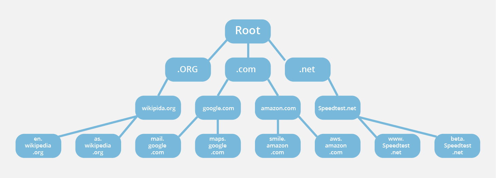
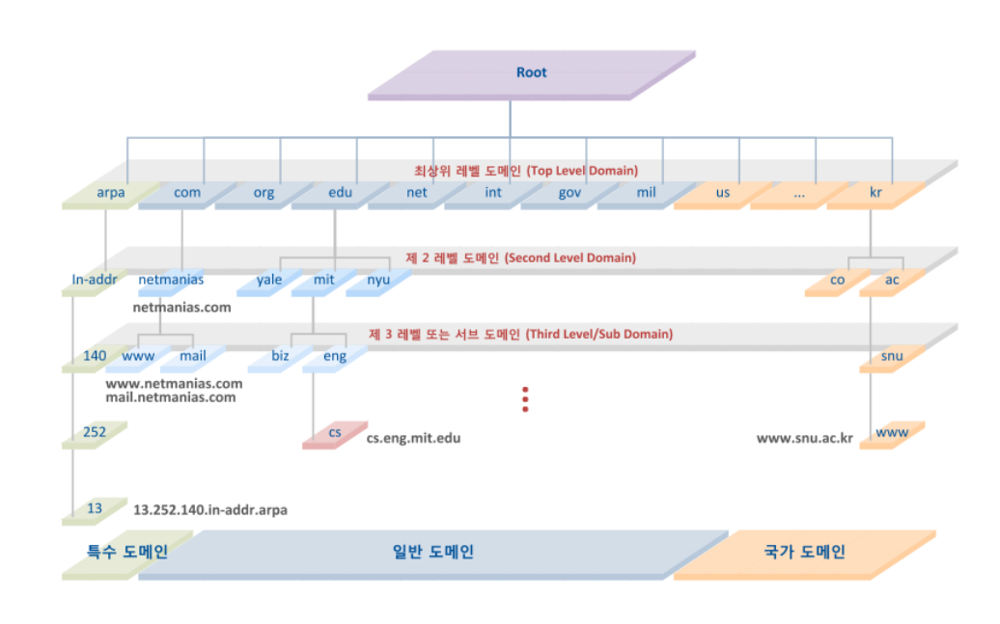

## DNS 와 그 작동원리
- DNS - **도메인 이름을 IP 주소로 변환**해 주는 시스템 (Domain Name System)
- DNS Server - 도메인 이름을 해당 IP 주소로 변환해, 사용자가 도메인을 입력하면 서버의 IP 주소로 연결되도록 돕는다.
    * DNS 서버 종류
        * **Local DNS Server** - 기지국 DNS 서버 (KT, SKT, LG)
        * **Root DNS Server** - 인터넷의 도메인 네임 시스템의 Root 존, *`ICANN`이 직접 관리하는 절대 존엄 서버로, TLD DNS 서버 IP들을 저장해두고 안내하는 역할을 한다. (전세계에 961개의 Root DNS가 운영되고 있다.)
        * **TLD(Top-Level Domain) DNS Server** - 최상위 도메인 서버(도메인 등록기관이 관리하는 서버)
        * **Authoritative DNS Server** - 일반적으로 도메인/호스팅 업체의 '네임서버' 를 말하지만, 개인이나 회사 DNS 서버 구축을 한 경우에도 해당
  > 이렇게 Local DNS Server가 여러 DNS 서버에 차례대로 (Root DNS 서버 -> TLD DNS 서버(.com) -> Authoritative DNS 서버(naver.com)) 요청하여 그 답을 찾는 과정을 재귀적 쿼리 Recursive Query 라고 부른다.   
  ** *`ICANN` : 국제 인터넷 주소 관리 기구    
  
### DNS 조회의 8단계

    1. 사용자가 웹 브라우저에 `naver.com`을 입력하면, 쿼리가 인터넷으로 이동하고 DNS 재귀 확인자(Local DNS 서버)가 이를 수신합니다.

    2. 이어서 확인자가 DNS 루트 이름서버(.)를 쿼리합니다.

---
    3. 다음으로, 루트 서버가 도메인에 대한 정보를 저장하는 최상위 도메인(TLD) DNS 서버(ex:.com 또는 .net)의 주소로 확인자에 응답합니다.
        naver.com을 검색할 경우의 요청을 .com TLD를 가리킵니다.

    4. 이제 확인자가 .com TLD에 요청합니다.

    5. 이어서, TLD 서버가 도메인 이름 서버(naver.com)의 IP 주소로 응답합니다.

    6. 마지막으로, 재귀 확인자가 도메인의 이름 서버로 쿼리를 보냅니다.

    7. 이제, example.com의 IP 주소가 이름 서버에서 확인자에게 반환됩니다.
    
    8. 이어서, DNS 확인자가, 처음 요청한 도메인의 IP 주소로 웹 브라우저에 응답합니다.

    DNS 조회의 8단계를 거쳐 example.com의 IP 주소가 반환되면, 이제 브라우저가 웹 페이지를 요청할 수 있습니다.

## 참조
[WEB-🌐-DNS-개념-동작-완벽-이해-★-알기-쉽게-정리](https://inpa.tistory.com/entry/WEB-%F0%9F%8C%90-DNS-%EA%B0%9C%EB%85%90-%EB%8F%99%EC%9E%91-%EC%99%84%EB%B2%BD-%EC%9D%B4%ED%95%B4-%E2%98%85-%EC%95%8C%EA%B8%B0-%EC%89%BD%EA%B2%8C-%EC%A0%95%EB%A6%AC)   
[CLOUDFLARE](https://www.cloudflare.com/ko-kr/learning/dns/what-is-dns/)
