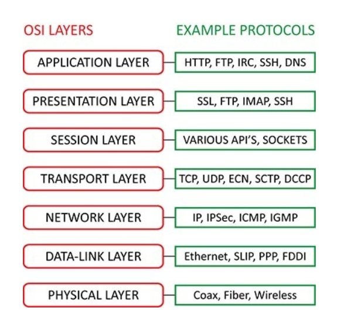
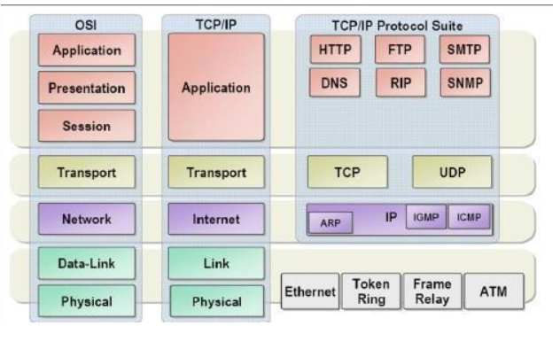
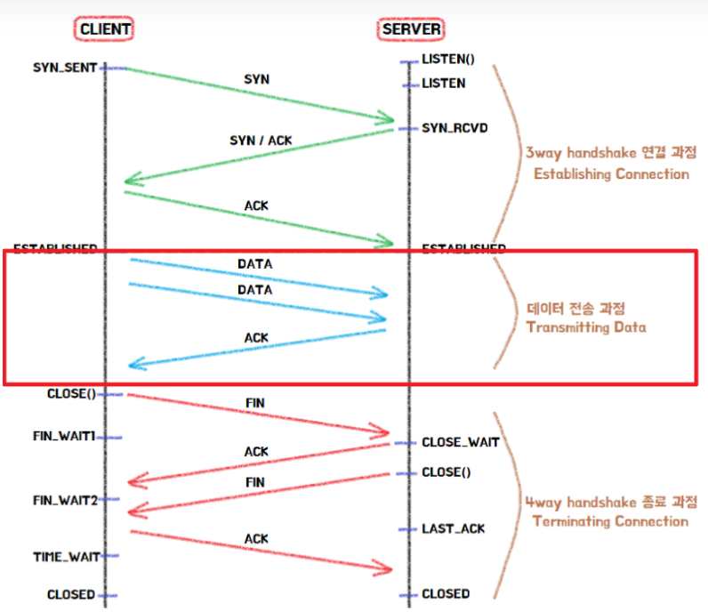
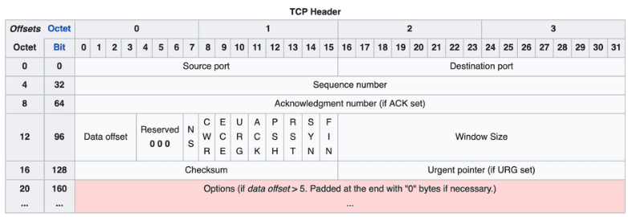
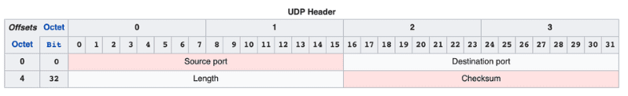
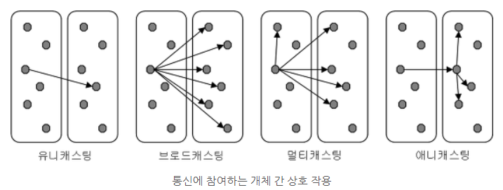

#TCP 와 UDP
- HTTP(Hypertext Transfer Protocol), **TCP**(Transmission Control Protocol), **UDP**(User Datagram Protocol) 는 다 **프로토콜(Protocol)** 이다.   
> 프로토콜(Protocol) : 컴퓨터 또는 전자 기기 간의 원활한 통신을 위해 지키기로 한 규약, 통신 규약  

### OSI 7 Layer별 프로토콜 구조
  

## TCP

- TCP (Transmission Control Protocol: 전송 제어 프로토콜): 연결 중심 방식으로 데이터를 안전하게 전송한다. 먼저 발신자와 수신자 간에 세 단계(3 Way Handshake)로 연결을 설정하고, 데이터 전송 중에도 각 패킷이 도착했는지 확인하며 오류가 발생하면 재전송을 요청한다. 이로 인해 전송 속도는 느려질 수 있지만, 데이터의 신뢰성이 보장된다.   
  - TCP 는 신뢰성 프로토콜답게, 한번 통신하는데 배달 하기 전에 목적지가 무사한지 미리 확인하고, 배달이 끝나고도 또 확인해주는 프로토콜
  - TCP 는 단어 그대로 원활한 통신을 위해 전송 흐름을 제어하는 기능을 프로토콜 자체에 포함하고 있다. 
  
  >3Way Handshake - 통신을 시작할 때 확인 과정   
  >4Way Handshake - 통신을 마칠 때 확인 과정

**TCP 의 전송 제어 기법 3가지**
- 흐름 제어(Flow Control) : 수신자가 처리할 수 있는 데이터 속도가 다르기 때문에, 송신 측은 수신측의 데이터 처리 속도를 파악하고 얼마나 빠르게 어느 정도의 데이터를 전송할 지 제어
  - 슬라이딩 윈도우(Sliding Windows) 방식 : Window라는 데이터를 담는 공간을 동적으로 조절하여 데이터량을 조절
- 오류 제어(Error Control) : 통신 도중에 데이터가 유실되거나 잘못된 데이터가 수신되었을 경우 대처
- 혼잡 제어(Congestion Control) : 네트워크가 불안정하여 혼잡 상태가 감지되면 송신측의 전송 데이터 크기를 조절하여 전송량을 조절한다.

### HTTP는 어떻게 TCP 위에서 동작할까?

**HTTP** : HTTP 도 TCP 기반으로 3 Way Handshake 후에 HTTP 요청을 통해 데이터를 주고 받는다.
1. `Client`는 서버와 3 Way Handshake로 통신을 위해 연결한다.(**연결지향적**)
2. `Client`의 HTTP 요청은 TCP를 통해 패킷으로 나뉘어 전송되며, **순서대로** 서버에 전달된다.
3. `Server`는 HTTP 요청을 받아 처리하고 응답을 준비한다. 
4. HTTP 응답도 상태코드와 함께 헤더와 본문으로 구성되어 있으며, 이 응답 역시 TCP를 통해 패킷으로 전송된다.
5. 각 패킷이 **순서대로** 클라이언트에 도달하도록 보장된다.
6. 요청과 응답이 종료되면 `Client`는 연결 종료를 위해 `FIN` 패킷을 날리며, 4 Way Handshake로 연결을 종료한다.
> 이 과정에서 TCP(프로토콜)가 패킷의 손실을 감지하고 재전송을 수행하기 때문에 HTTP는 `애플리케이션 레벨(OSI 7 계층)`에서 데이터의 전송 신뢰성을 신경 쓸 필요가 없다.

### 웹소켓은 어떻게 TCP 위에서 동작할까?
**웹소켓** : 웹소켓(Web Socket) 프로토콜은 HTTP와는 다른 통신 프로토콜로 웹 서버와 웹 브라우저가 서로 실시간 메시지를 교환하는 데에 사용된다.
웹소켓은 TCP 소켓과 이름만 유사할 뿐 브라우저의 소켓이며, 웹소켓 프로토콜은 **HTTP 와 동일하게 애플리케이션 계층에서 동작한다.** 그리고 평문 메시지 전송 방식이므로, SSL/TLS 보안 계층으로 암호화되어야 데이터 탈취를 방지할 수 있다.
1. 웹소켓은 HTTP 기반으로 초기 연결을 설정합니다. (**HTTP Handshake**)
2. `Client`는 표준 HTTP 요청을 통해 서버에 연결을 시도하며, **업그레이드 헤더(Upgrade: Websocket)** 를 포함하여 웹소켓으로 전환 요청한다.
3. `Server`가 웹소켓 연결을 허용하면 `HTTP 101 Switching Protocols` 상태 코드로 응답하여 연결을 웹소켓으로 업그레이드 한다.
4. 이제 HTTP는 연결 설정에만 사용되며, 이후 데이터 전송은 웹소켓 프로토콜을 통해 TCP연결을 직접 이용해 이뤄진다.
> TCP 의 `3Way Handshake`와 웹소켓의 `HTTP Handshake` 는 프로토콜의 계층이 다르다.   
> TCP의 `3Way Handshake`의 경우는 전송 계층 (OSI 4 계층)에서 이루어 지지만,    
> 웹소켓의 `HTTP Handshake`는 애플리케이션 계층(OSI 7 계층)에서 이루어진다. 

---

## UDP 

- UDP (User Datagram Protocol: 사용자 데이터그램 프로토콜): 비연결형 방식으로 데이터를 빠르게 전송한다. 데이터는 별도의 확인 과정 없이 단일 패킷으로 보내지며, 손실이나 오류를 확인하지 않는다. 그 결과 전송 속도가 빠르지만 데이터가 누락될 가능성이 있다. 

### UDP 가 빠른이유?
- 신뢰성 검증을 위한 절차가 없고, 연결(**Handshake**)을 설정하지 않는다.
- **TCP**의 경우 신뢰성 검증(`흐름제어`, `오류제어`, `혼잡제어`) 를 위해 여러 최소 `20Bytes` 이상의 헤더값을 사용하지만 **UDP**헤더는 `8Bytes`로 간단히 구성됨.
- 당연히 통신 시 흐름제어, 오류제어, 혼잡제어 등의 과정을 거치지 않기 때문에 빠를 수 밖에 없다.

### UDP를 활용한 통신방식

- `유니캐스팅` : **TCP** 의 경우 유니캐스팅 방식으로 동작한다. 
- `브로드캐스팅` : 네트워크 상의 모든 기기에 데이터를 전송하는 방식.
  - 주로 로컬 네트워크에서만 사용되며, 대규모 네트워크(인터넷) 에서는 사용되지 않는다.
- `멀티캐스팅` : 지정된 여러 수신자 그룹에만 데이터를 전송하는 방식.
  - 네트워크 효율이 높어지고, VoIP나 비디오 스트리밍 등에서 많이 사용된다.

>HTTP/3 가 UDP를 선택한 이유...

### 참조
[NW-🌐-아직도-모호한-TCP-UDP-개념-❓-쉽게-이해하자](https://inpa.tistory.com/entry/NW-%F0%9F%8C%90-%EC%95%84%EC%A7%81%EB%8F%84-%EB%AA%A8%ED%98%B8%ED%95%9C-TCP-UDP-%EA%B0%9C%EB%85%90-%E2%9D%93-%EC%89%BD%EA%B2%8C-%EC%9D%B4%ED%95%B4%ED%95%98%EC%9E%90)   
[네트워크-계층별-프로토콜Layer-Protocol](https://velog.io/@mingkimk/%EB%84%A4%ED%8A%B8%EC%9B%8C%ED%81%AC-%EA%B3%84%EC%B8%B5%EB%B3%84-%ED%94%84%EB%A1%9C%ED%86%A0%EC%BD%9CLayer-Protocol)   
[웹소켓으로 개발하기 전 알아야 할 것들](https://yozm.wishket.com/magazine/detail/1911/)   
[TCP의 연결설정, 데이터 전송, 연결 해제](https://hongcana.tistory.com/76)   
[TCP의 헤더에는 어떤 정보들이 담겨있는걸까?](https://evan-moon.github.io/2019/11/10/header-of-tcp/#%ED%8C%A8%ED%82%B7-%EA%B5%90%ED%99%98-%EB%B0%A9%EC%8B%9D%EC%9D%98-%EB%AC%B8%EC%A0%9C%EC%A0%90)   
[HTTP/3는 왜 UDP를 선택한 것일까?](https://evan-moon.github.io/2019/10/08/what-is-http3/)   
[UDP - 브로드캐스팅 Broadcasting](https://blog.naver.com/kbm0996/221045822230)

